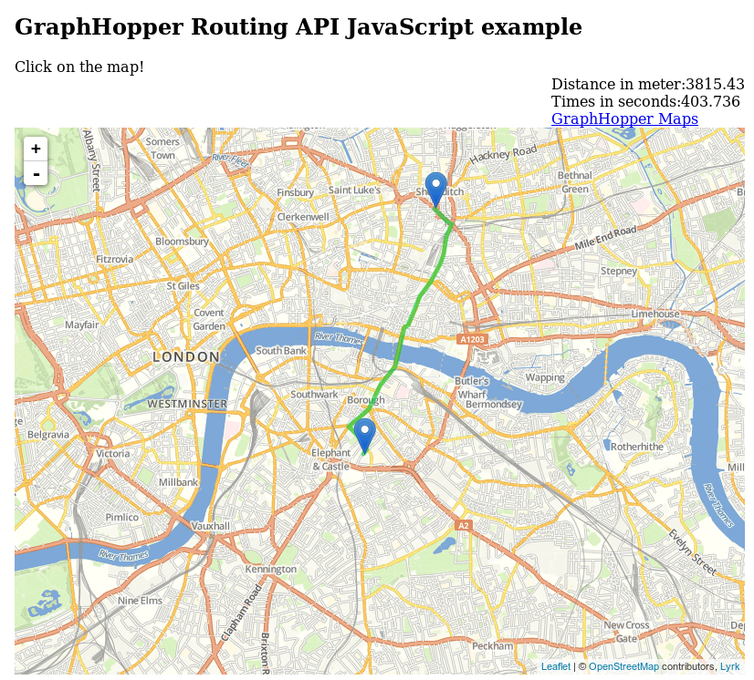
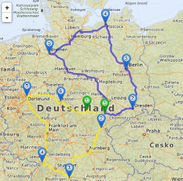
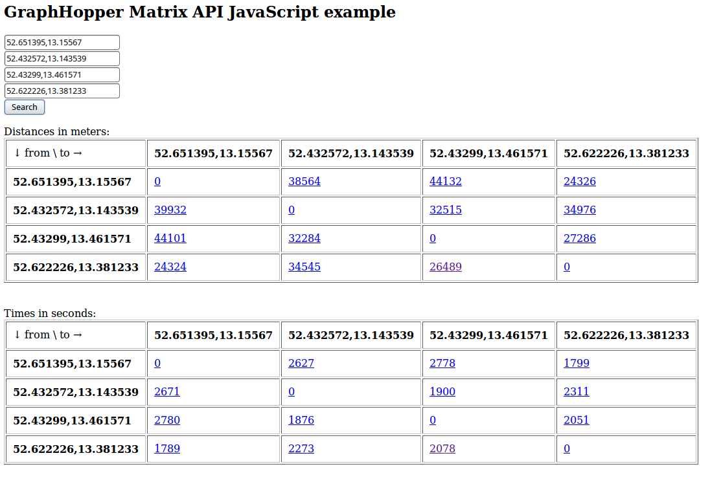
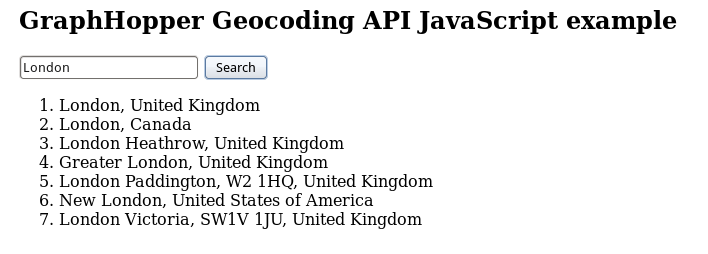
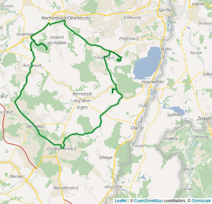

# JavaScript client for the Directions API

[](https://travis-ci.org/graphhopper/directions-api-js-client)

This project offers JavaScript clients and examples for the [GraphHopper Directions API](https://graphhopper.com).

**Try the live examples [here](https://graphhopper.com/api/1/examples/).**

Also see how we integrated the Routing and the Geocoding API to build a fully featured maps application called [GraphHopper Maps](https://graphhopper.com/maps/)

## Getting Started

### CDN

You can use the hosted js client by adding it to your HTML like this:

```
 <script src="https://cdn.jsdelivr.net/npm/graphhopper-js-api-client/dist/graphhopper-client.js"></script>
```

You can then use it like this:
```
<script>
  window.onload = function() {

    var ghRouting = new GraphHopper.Routing({
      key: "[Sign-up for free and get your own key: https://www.graphhopper.com/products/]",
      vehicle: "car",
      elevation: false
    });

    ghRouting.addPoint(new GHInput(47.400905, 8.534317));
    ghRouting.addPoint(new GHInput(47.394108, 8.538265));

    ghRouting.doRequest()
      .then(function(json) {
        // Add your own result handling here
        console.log(json);
      })
      .catch(function(err) {
        console.error(err.message);
      });


  };
</script>
```

### NPM

Install the lib with npm:

```npm install graphhopper-js-api-client --save```

You can either require the whole client enabling you to use every GraphHopper API, but you can also only require the pieces you need.
```
 require('graphhopper-js-api-client');
 // If you only need e.g. Routing, you can only require the needed parts
 //var GraphHopperRouting = require('graphhopper-js-api-client/src/GraphHopperRouting');
 //var GHInput = require('graphhopper-js-api-client/src/GHInput');
 
 window.onload = function() {
 
     var defaultKey = "[Sign-up for free and get your own key: https://www.graphhopper.com/products/]";
     var profile = "car";
 
     var host;
     var ghRouting = new GraphHopper.Routing({key: defaultKey, host: host, vehicle: profile, elevation: false});
     // If you only need e.g. Routing, you can only require the needed parts
     //var ghRouting = new GraphHopperRouting({key: defaultKey, host: host, vehicle: profile, elevation: false});
 
     // Setup your own Points
     ghRouting.addPoint(new GHInput(47.400905, 8.534317));
     ghRouting.addPoint(new GHInput(47.394108, 8.538265));
 
     ghRouting.doRequest()
     .then(function(json){
        // Add your own result handling here
        console.log(json);
     })
     .catch(function(err){
        console.error(err.message);
     });
 
 };
```

## Running Tests

In order to run the tests, you have to register for a key on [GraphHopper](https://www.graphhopper.com/).
Either set your key as environment variable using `export GHKEY=YOUR_KEY` or set your key in `spec/helpers/config.js`.
You can run all tests via `npm test`. 
If you only want to run a single spec file, you can use the `--spec` option, e.g., `npm test --spec spec/GraphHopperRoutingSpec.js`.

## Dependencies

The API depends on superagent and bluebird which are packaged into the graphhopper-client.js.

The demo uses a couple of dependencies, but they are not required for requests to the API.

## Integrate the APIs in your application

You can either use our [bundled version](./dist/graphhopper-client.js), including all APIs or you can use only the 
pieces you need.

### GraphHopper Routing API



You need [the routing client](./src/GraphHopperRouting.js).

There is also a different client developed from the community [here](https://www.npmjs.com/package/lrm-graphhopper).

### GraphHopper Route Optimization API



You need [the optimization client](./src/GraphHopperOptimization.js).

### GraphHopper Isochrone API


You need [the isochrone client](./src/GraphHopperIsochrone.js)

### GraphHopper Matrix API



You need [the matrix client](./src/GraphHopperMatrix.js).

### GraphHopper Geocoding API



You need [the geocoding client](./src/GraphHopperGeocoding.js).

### GraphHopper Map Matching API



You need [the map matching client](./src/GraphHopperMapMatching.js) and the 
[togeojson.js](./js/togeojson.js)

## Releasing a new Version to NPM

Releasing a new version to NPM is easy.

Set the version you like to publish in the `package.json`. It's important to understand, that every version can only be published once and cannot be overwritten.

Tag the commit you like to publish for example like this:
```
git log # get the commit hash of the commit you want to tag
git tag <tag> <commit-hash>
git push origin --tags
```

Travis will then build and publish the commit to NPM.

## License

Code stands under Apache License 2.0
